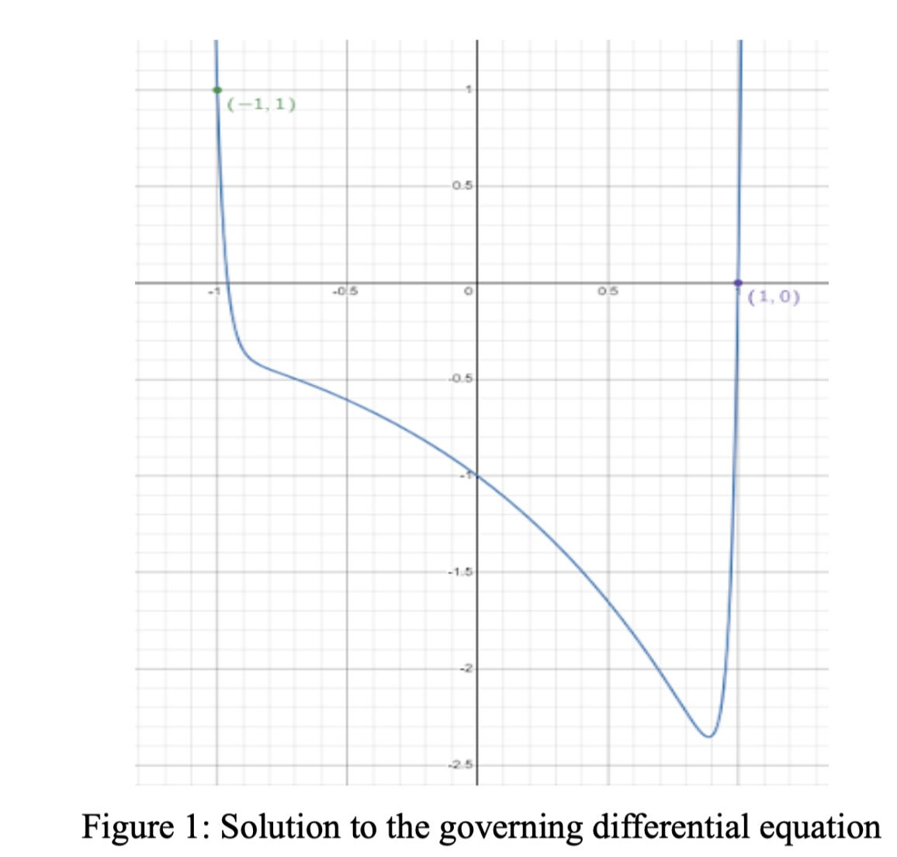
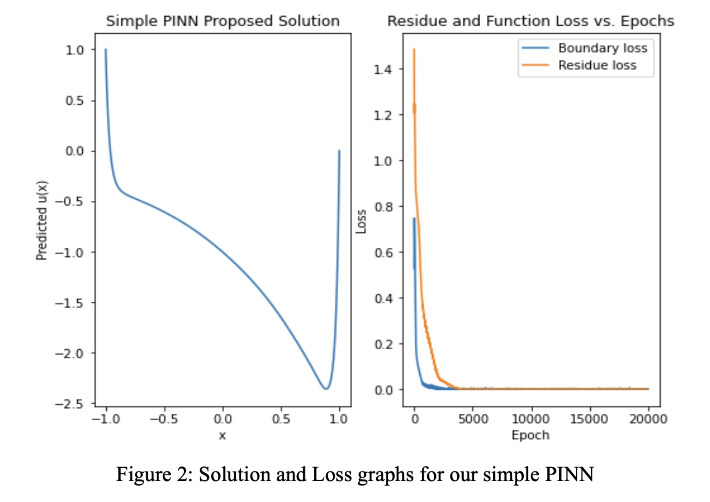
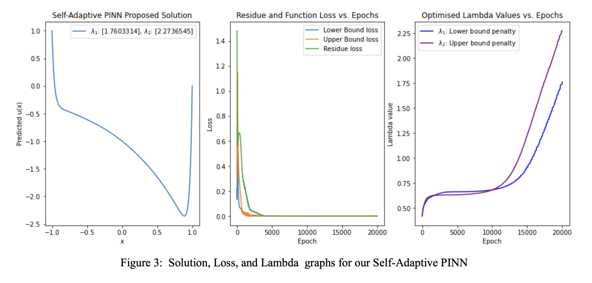

# PINNs
- M. Beekenkamp, A. Bhagavathula, P. LaDuca.

## Introduction
Physics Informed Neural Networks (PINNs), originally proposed in the paper “Physics-informed neural networks: A deep learning framework for solving forward and inverse problems involving nonlinear partial differential equations” by Raissi, Perdikaris, and Karniadakis, are domain-informed neural models that can approximate solutions to partial differential equations (PDEs). By imposing known physical laws onto the neural network the solution space can be restricted to the governing equation, decreasing training time, data requirements, and encoding the physical laws into the model. This paper became the basis for the first portion of this project (simple_pinn.py), with Self-Adaptive PINNs (SA-PINNs) forming the second (self_adaptive_pinn.py). 
SA-PINNs, as proposed in the paper “Self-Adaptive Physics-Informed Neural Networks using a Soft Attention Mechanism” by McClenny, and Braga-Neto extend on the work of a simple PINN by adding a self-adaptive element which optimally regularises the components of the implemented loss function. Notably, SA-PINNs automate a process which hitherto was done by trial and error, or from information on the optimal solution known before training. The addition of the self-adaptive component further improves on the strengths of PINNs, the decreased training time, data requirements, and encoded physical laws. 
PINNs have emerged as an application of deep learning in computational sciences, outperforming previous solvers across the aforementioned metrics. 

## Methodology
Our project currently focuses on solving a 1-dimensional time-independent PDE in a no-data regime, implementing both a simple PINN and a SA-PINN in JAX. Mathematically the equation can be represented as:
$$vu_{xx} - u = e^x$$
$$u(-1) = 1; u(1) = 0; x[-1,1]; v = 10^{-3}$$
As we are solving the equation in a no-data regime, the input is instead n uniformly distributed collocation points. We chose to solve the same equation for both models, consequently, the basic architecture is shared between the models. Each network had an input layer, three hidden layers each of size 20, and an output layer. Each layer used a hyperbolic tangent activation function and both models applied an Adam optimiser to the network parameters. Due to efficiencies found in JAX, most notably due to the jit (just-in-time) compiler, and those inherent to PINNs, our models took less than a minute to train on our laptops. This made training the model for 20,000 epochs, in keeping with the literature, a reasonable choice.

> A key feature of self-adaptive PINNs is that the loss $\mathcal L(w, \lambda_r, \lambda_b, \lambda_0)$ is minimized with respect to the network weights $w$, as usual, but is maximized with respect to the self-adaptation weights $λr , λb , λ0$ , i.e., the objective is: $$\min\limits_{w} \max\limits_{\lambda_r, \lambda_b, \lambda_0} \mathcal L(w, \lambda_r, \lambda_b, \lambda_0). $$
> L. D. McClenny, U. Braga-Neto.

The key component of PINNs is the custom loss function. Our loss function consisted of two portions, the boundary loss and the residual loss. The loss from our boundary conditions, and from our equation respectively. The residual loss function is the unique component of PINNs, enforcing the physical structure into the network. 
$$MSE_{residual} = \frac{1}{n} \sum [u_{xx} - u - e^x]^2$$
$$MSE_{lower bound} = [u(-1)-1]^2$$
$$MSE_{upper bound} = u(1)^2$$
$$Loss = MSE_{residual} + MSE_{lower bound} + MSE_{upper bound}$$
The SA-PINN differs from a simple PINN here by automatically regularising boundary loss during training, and introducing post training optimisation. This is achieved by introducing additional training parameters ($\lambda$). The model applied an Adam optimiser to the $\lambda$ parameters, additional to the weights, and applied a L-BFGS-B minimiser to the weights at the end of training. By using these learned weighting of the boundary losses, the model could theoretically achieve lower residual loss, especially when using a low number of collocation points.
$$Loss = MSE_{residual} + \lambda_1 MSE_{lower bound} + \lambda_2 MSE_{upper bound}$$

## Results
Since our model currently does not require data, we can not assess the accuracy of the model based on labels as is done when using data inputs. Instead, due to the model being constrained by the differential equation we are looking to solve, loss is a good metric for accuracy since it directly relates how well the output of our model follows the differential equation. Calculating the loss of a set of points much larger than the training collocation points allows for the assessment of how well the model is able to interpolate the function. 
It is important to note the impact collocation points have on the results of this model. Using a greater number of collocation points allows for the model to create smoother curves which will reduce the loss. Less collocation points makes it harder to learn the solution, especially for solutions with large changes in gradient. The number of collocation points is analogous to the amount of data given to the model. Additionally, since the output is a graph, we can qualitatively check how well the output solution matches to the theoretical solution.

Both our simple PINN and SA-PINN were able to accurately solve the unique solution to the differential equation given the boundary conditions. The graphs below clearly showcase accurate boundary conditions as well as a general structure that qualitatively matches the solution (Fig. 2 & 3) to the equation (Fig. 1), indicating that both models were able to correctly learn the differential equation. Looking at the loss graphs (Fig. 2 & 3) we can clearly see that the loss was effectively minimised in both models. As shown in Figure 3, the lambda values from the SA-PINN reach a regime in which they increase linearly, a behaviour which matches with the literature.

Assessing the loss associated with the models leads to further insight. Table 1 shows the residual loss with 201 uniformly distributed points and with the training set of points as well as the boundary loss for the simple PINN and the SA-PINN before and after L-BFGS-B optimisation. It is evident that the self-adaptive PINN has better accuracy in regards to both the boundary and residual loss after the L-BFGS-B optimisation for the training set of points. When calculating the loss over the larger testing set of points the SA-PINN does significantly better than the simple PINN, reducing loss by almost an order of magnitude whereas when only the training set is used the loss is more similar. This indicates that the SA-PINN is able to better learn the function while the simple PINN is overfitting a bit. Interestingly, the loss from the self-adaptive PINN prior to L-BFGS-B optimisation is higher than the simple PINN; however, when applied to the testing set it results in lower loss than both the simple and self-adaptive PINN with L-BFGS-B optimization. This suggests that the L-BFGS-B is also overfitting the model which can be seen by how far the loss for the boundary points drops when applying the L-BFGS-B optimization. Still, the self-adaptive PINN was better able to learn the function than the simple PINN both with and without the L-BFGS-B optimization.

| |Simple PINN|SA-PINN with L-BFGS-B optimisation|SA-PINN without L-BFGS-B optimisation|
|:-:|:-|:-|:-| 
|Upper bound loss|1.09e-5*|1.12e-3|8.67e-11|
|Lower bound loss|1.09e-5*|4.85e-4|4.60e-12|
|Residual (training)|3.50e-6|1.83e-5|2.18e-6|
|Residual (testing)|1.57e-3|3.88e-4|3.94e-4|

Table 1: Loss values
*combined loss for both boundaries

## Socially Responsible Computing Implications
PINNs are a new and interesting way to solve PDEs, but they also have interesting socially responsible computing implications. The strength of PINNs lie, in part, due to their ability to operate accurately with small amounts of data. By constraining the output of the neural network to match physical reality, the number of possible solutions is drastically constrained, improving training time and energy cost. Which lowers the barrier of entry to applying deep learning techniques in the natural sciences. In this project we used a differential equation which had one unique solution allowing us to solve it without input data. In other cases, a PINN can be given data alongside a constraint equation which may be more general and not have a single unique solution. Ideally a basic neural network can approximate the function without the constraint but incorporating the contraining equation improves how well the neural network is able to achieve its approximation. Applying this sort of constraint to the output space is an idea that can possibly be generalised to other applications and help improve machine learning as well as reduce energy and time costs in training. 

## Motivating Literature and Sources
Raissi, M., Perdikaris, P., & Karniadakis, G. (2019). [Physics-informed neural networks: A deep learning framework for solving forward and inverse problems involving nonlinear partial differential equations.](https://www.sciencedirect.com/science/article/pii/S0021999118307125) Journal of Computational Physics, 378, 686–707.

Levi D. McClenny, & Ulisses M. Braga-Neto (2020). [Self-Adaptive Physics-Informed Neural Networks using a Soft Attention Mechanism.](https://arxiv.org/abs/2009.04544) CoRR, abs/2009.04544.
